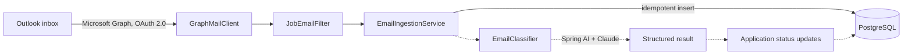

# ApplyTrack

A Spring Boot backend that reads a personal Outlook inbox through the Microsoft Graph API, picks out job and internship emails, and classifies them with an LLM so the status of every application can be tracked automatically.

> **Status:** work in progress. See [Roadmap](#roadmap) for what is built and what is next.

## How it works



Solid lines are implemented. Dashed lines are the next milestone.

1. **Sign in once.** The app uses the OAuth 2.0 device code flow (MSAL4J) with the read-only `Mail.Read` scope. The refresh token is cached locally so scheduled runs can fetch new access tokens silently.
2. **Fetch.** `GraphMailClient` pages through recent inbox messages, requesting immutable message IDs and plain-text bodies.
3. **Filter.** `JobEmailFilter` keeps messages that look job-related (applicant tracking system senders, job keywords) and drops known noise such as job-alert digests.
4. **Store.** Each message is saved once. A `UNIQUE` constraint on `message_id` plus an existence check make ingestion idempotent, so reruns and overlapping runs never create duplicates.
5. **Classify.** `EmailClassifier` asks an LLM (through Spring AI) for a structured result: category, company, role, deadline, and confidence. Email text is cleaned and truncated first, retried on transient failures, and falls back to `UNCLASSIFIED` rather than failing.

## Tech stack

Java, Spring Boot 4, Spring Data JPA, PostgreSQL, Flyway, Spring AI (Anthropic Claude), Microsoft Graph API, MSAL4J, JUnit 5, Mockito, Testcontainers, Docker Compose.

## Getting started

**Prerequisites:** JDK 21+, Docker, a personal Outlook account, a Microsoft Entra directory (a free Azure account works) to register the app, and an Anthropic API key scoped to a workspace.

1. **Start Postgres**

   ```bash
   docker compose up -d
   ```

2. **Register the app** in the Entra admin center under *App registrations → New registration*.
   - Supported account types: *Accounts in any organizational directory and personal Microsoft accounts*.
   - Under *Authentication*, set *Allow public client flows* to **Yes**.
   - No client secret or redirect URI is needed. Copy the Application (client) ID.

3. **Create `src/main/resources/application-local.yaml`.** This file is gitignored. Never commit it.

   ```yaml
   spring:
     ai:
       anthropic:
         api-key: YOUR_ANTHROPIC_API_KEY
   app:
     graph:
       client-id: YOUR_APPLICATION_CLIENT_ID
   ```

4. **Sign in once.** The app prints a code and a URL. Open the URL, enter the code, and approve `Mail.Read`.

   ```bash
   ./mvnw spring-boot:run -Dspring-boot.run.profiles=local -Dspring-boot.run.arguments=--login
   ```

5. **Run the app and ingest.**

   ```bash
   ./mvnw spring-boot:run -Dspring-boot.run.profiles=local
   curl -X POST localhost:8080/api/ingest
   curl localhost:8080/api/emails
   ```

## Configuration

| Property | Default | Purpose |
|---|---|---|
| `app.graph.client-id` | `not-configured` | Entra application (client) ID |
| `app.graph.token-cache-file` | `.msal-cache.json` | Where the refresh token cache is stored (gitignored) |
| `app.ingest.enabled` | `false` | Turns on the scheduled ingestion job |
| `app.ingest.interval` | `PT15M` | Delay between scheduled runs (ISO-8601 duration) |
| `app.ingest.lookback-days` | `14` | How far back each run looks |
| `spring.ai.anthropic.api-key` | `not-configured` | Anthropic API key |

## API

| Method | Path | Description |
|---|---|---|
| `POST` | `/api/applications` | Create an application |
| `GET` | `/api/applications` | List applications, optionally `?status=INTERVIEW` |
| `GET` / `PUT` / `DELETE` | `/api/applications/{id}` | Read, update, delete |
| `GET` | `/api/applications/{id}/emails` | Emails linked to an application |
| `POST` | `/api/ingest` | Run ingestion now |
| `GET` | `/api/emails` | Most recent stored emails |
| `POST` | `/api/classify` | Classify pasted text (development only) |

## Testing

```bash
./mvnw test
```

Docker must be running, because integration tests use Testcontainers to start a real PostgreSQL instance. Unit tests cover the email filter, text cleaner, and classifier retry and fallback logic without any network calls.

## Privacy and security

- **Read-only access.** Only the delegated `Mail.Read` scope is requested.
- **Minimal storage.** The database keeps the subject, sender, date, and a short preview. Full bodies are never stored.
- **Data sent to a third party.** Email text is sent to the Anthropic API for classification. It is cleaned (quoted replies and signatures removed) and truncated to 3,000 characters first, and only job-related messages are sent.
- **Prompt injection.** Email content is treated as untrusted data. The system prompt instructs the model to ignore instructions found inside it, and this is covered by a manual test.
- **Secrets.** The client ID, API key, and token cache are all gitignored. The token cache file grants access to the mailbox, so treat it like a password.

## Design decisions

- **Microsoft Graph over IMAP:** structured JSON, OAuth 2.0 instead of stored passwords, and server-side field selection.
- **Flyway owns the schema, Hibernate only validates:** schema changes are versioned and reviewable, and a mismatch fails at startup.
- **Immutable message IDs:** default Graph IDs change when a message moves folders, which would defeat deduplication.
- **Filtering in Java, not in the Graph query:** easier to unit test, and tuned for recall because a false positive just becomes `OTHER`.
- **A `MailClient` interface** keeps the provider swappable and ingestion testable with mocks.
- **Failure policy for the LLM:** retry with backoff, then mark `UNCLASSIFIED` so one bad email never blocks a batch.

## Known limitations

- Each run re-fetches the lookback window. Graph delta queries would fetch only what changed.
- Single user by design. The API has no authentication and is intended to run on localhost.
- The token cache is a plaintext file on disk.
- The job-email filter's recall has not been measured against labeled data yet.

## Roadmap

- [x] Application and email log model, CRUD API, integration tests
- [x] Microsoft Graph sign-in with persistent token cache
- [x] Idempotent, scheduled ingestion with a job-email filter
- [x] LLM classifier with structured output, retries, and fallback
- [ ] Classify during ingestion and update application status (forward-only transitions)
- [ ] Accuracy evaluation on a hand-labeled set of emails
- [ ] Discord or Telegram alerts for interview and assessment emails
- [ ] Dockerfile, full Docker Compose setup, and GitHub Actions CI
